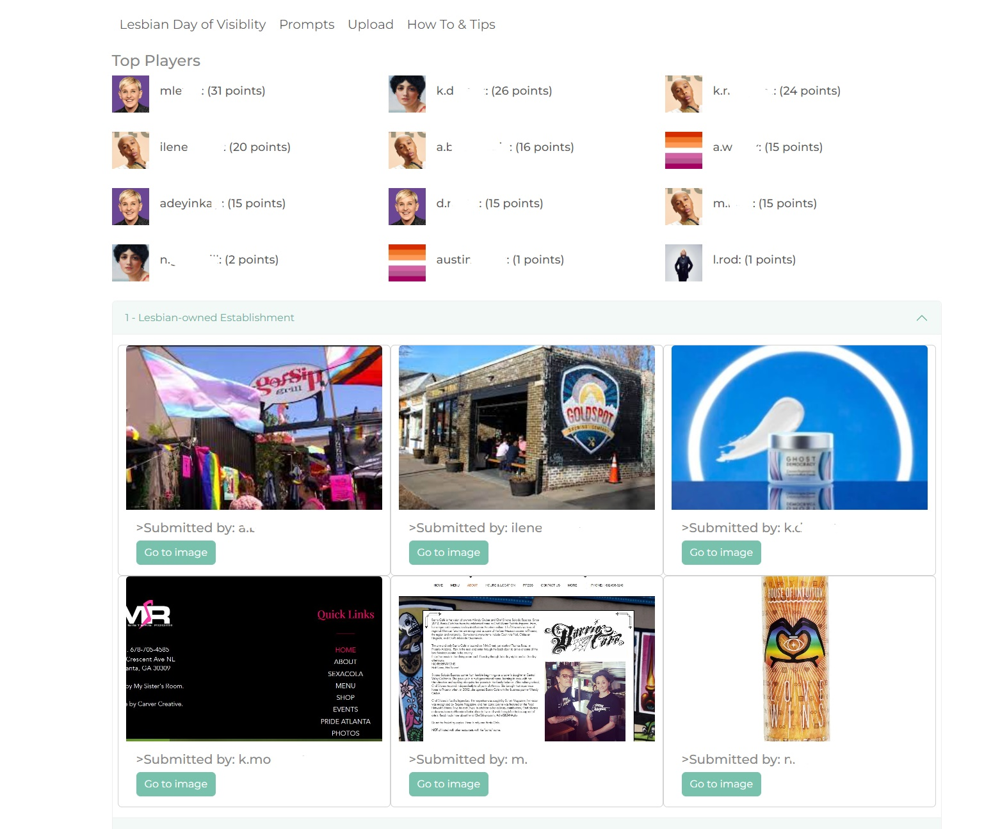
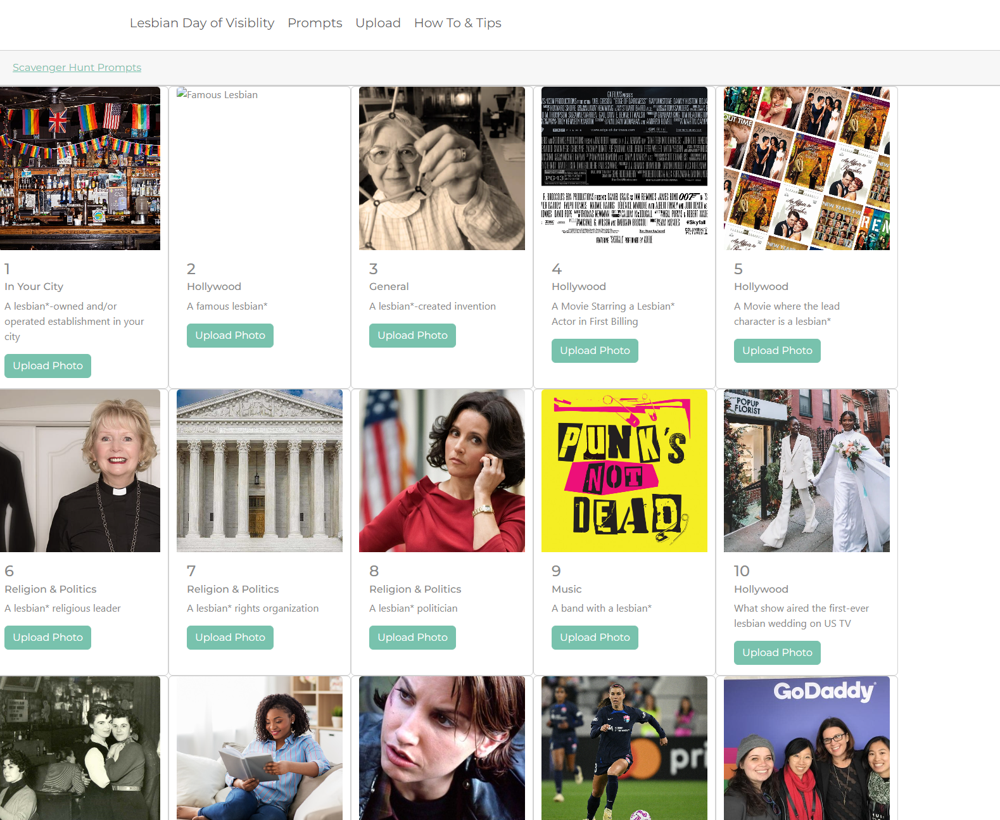
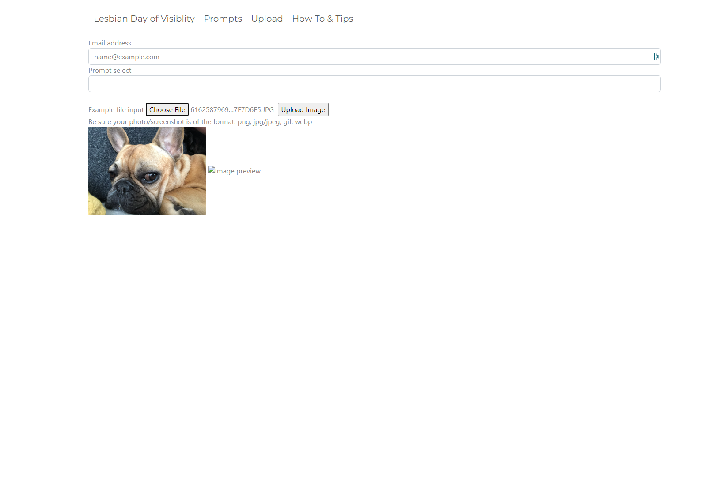
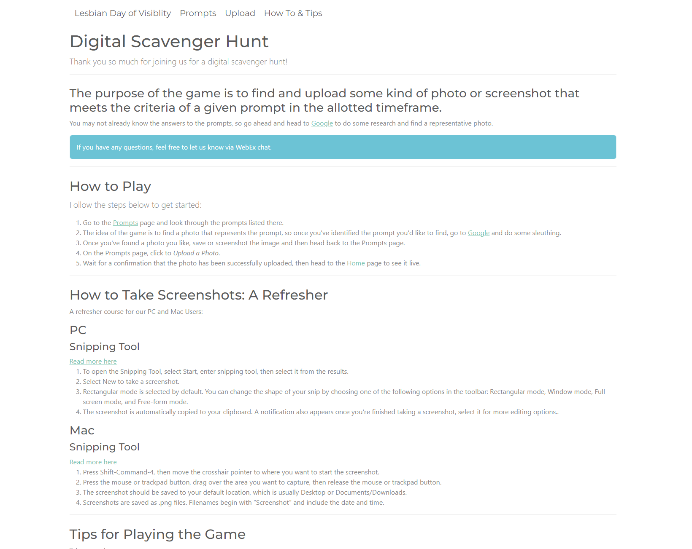

# Virtual Scavenger Hunt

This Virtual Scavenger Hunt project was originally created as an education-based event for Lesbian Day of Visibility 2023 and can be used as a 
Virtual Scavenger Hunt template for other projects. It was built using FastAPI (python), Jinja templates, and deployed on Google App Engine. 

Google App Engine is a fully managed, serverless platform for developing and hosting web applications at scale on Google 
Cloud. 


## How To Play

The purpose of the game is to find and upload some kind of photo or screenshot that meets the criteria of a given prompt in the allotted timeframe. 

Once up and running:

* Go to the Prompts page and look through the prompts listed there.
* The idea of the game is to find a photo that represents the prompt, so once you've identified the prompt you'd like to find, go to Google and do some sleuthing.
* Once you've found a photo you like, save or screenshot the image and then head back to the Prompts page.
* On the Prompts page, click to Upload a Photo.
* Wait for a confirmation that the photo has been successfully uploaded, then head to the Home page to see it live.


## Technologies

### Google Cloud
<br>

<br>

* Sign up for an [acccount](https://cloud.google.com/) <br>
* Download the [Google Cloud CLI](https://cloud.google.com/sdk)

### Python
<br>

<br>

### FastAPI
<br>

<br>

* Learn more about [FastAPI here](https://fastapi.tiangolo.com/lo/) 

### Jinja
<br>

<br>

* Learn more about [Jinja templating here](https://jinja.palletsprojects.com/en/3.1.x/) 

### Bootstrap
<br>

<br>

* Learn more about [Bootstrap here](https://getbootstrap.com/) 


## Setup

For more information in general, take a look at https://medium.com/analytics-vidhya/deploying-fastapi-application-in-google-app-engine-in-standard-environment-dc061d3277a or https://github.com/kamalgill/cloud-starterkit-fastapi-appengine

Note: Since this is built on Google App Engine & Google Storage, be aware of any costs you may incur

1. Enable Google App Engine in your Google Cloud account
2. Install the gcloud CLI https://cloud.google.com/sdk 
3. Create a gcloud project if you haven't already & set up billing
4. Create a bucket called `lesbian-visibility-day` (or if using this as a template, update main.py with the bucket name)
5. Create a service account for Google App Engine and your application to use and store the credentials to the `creds/` folder

## Deploy

```
gcloud app deploy ./app.yaml
```

## Viewing
You can view your deployed app via

```
gcloud app browse
```

The current site to view this at is https://lgbt-tv-data.uc.r.appspot.com/ (note: may be brought down in the future due to cost)

Here's the home page:


Here's the prompts page:


Here's the upload page:


Here's the tips and how to page:



